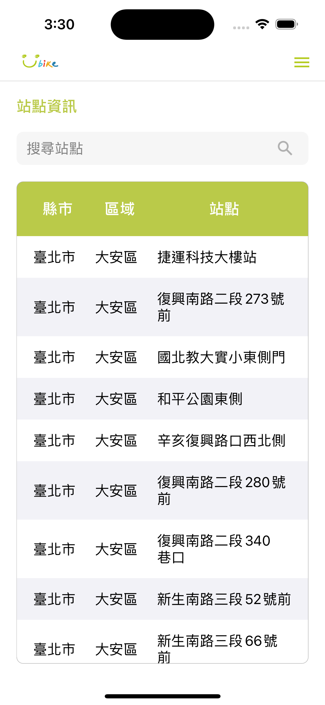
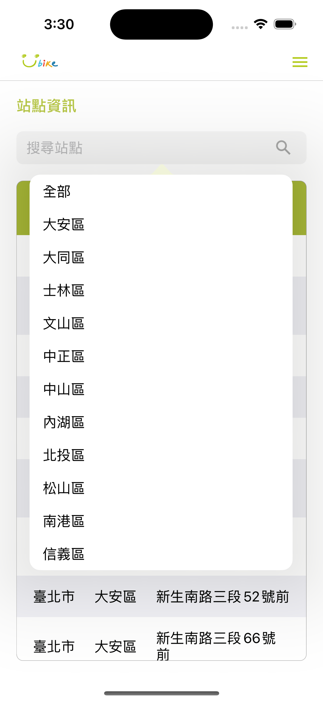

# Introduction
This's a Taipei Ubike spot app which has some feature below
* Filter
* Pull to refresh
* Switch to different page

The Api provided by [政府開放資料平台](https://data.gov.tw/dataset/137993)

# Showcase

# Hierarchy
* `Datamanager.swift`: Fetch Api things
* `ApiUrl.swift`: Manage all api url
* Extension/
  * `Array+Extension.swift`: Add a function make array into unique array
* Controllers/
  * `SpotInformationViewController.swift`: Show ubike spot information and search bar and stuff
  * `MenuViewController.swift`: Show menu to display all page feature
  * `AreaPopoverViewController.swift`: Show area table for popover
  * `LabelViewController.swift`: Only show single label, just for fill other page
* Moels
  * `UbikeSpot.swift`: A model to store ubike spot
* Views
  * `Main.storyboard`
  * `SpotTableViewCell.swift`: Custom table view cell
  * `SpotInfoTableView.swift`: Ubike spot table
* `AppDelegate.swift`
* `SceneDelegate.swift`
* `LaunchScreen.storyboard`
* `Localizable.xcstrings`
* `Assets.scassets`
* `Info.plist`